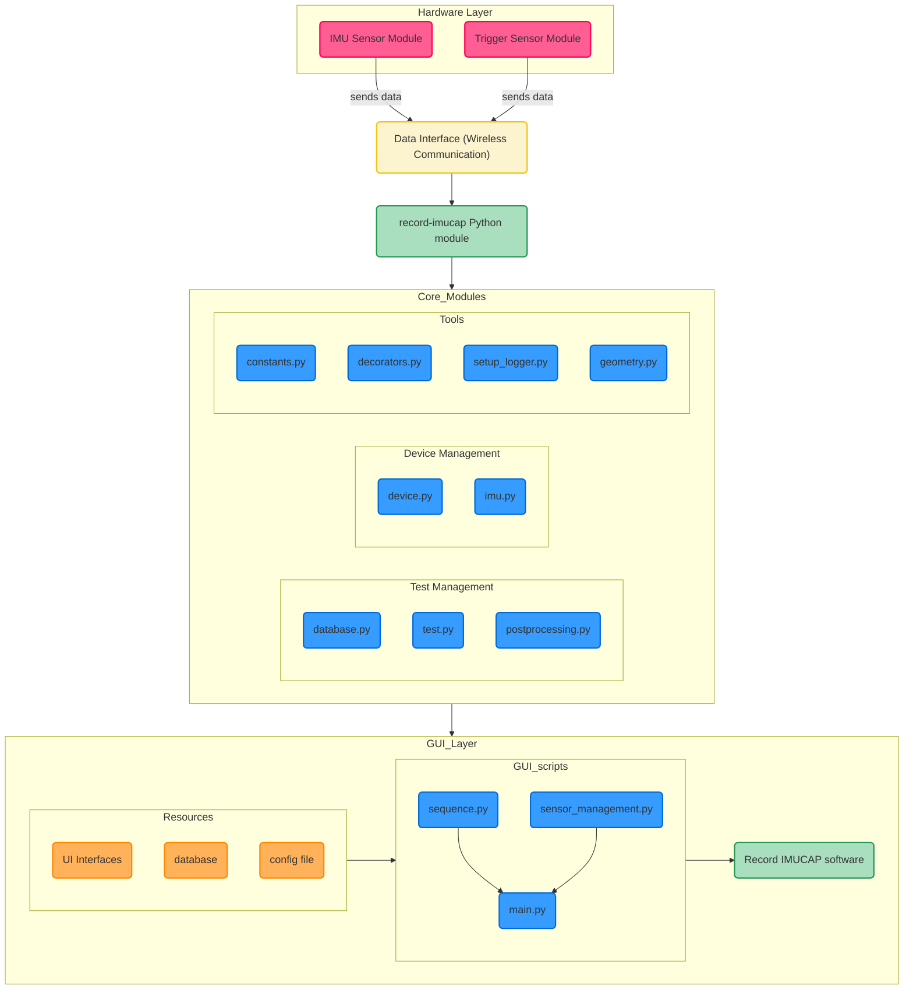

### ANR-SHINE Project (ANR-22-EXES-0017)
RECORD: **R**econfigurer l’**É**valuation du **COR**ps en **D**éplacement (Reconfiguring the Evaluation of the BODY in Motion) — a valuable step toward understanding body schema disorders and developing appropriate therapeutic care.<br />

<table>
<tbody>
  <tr>
    <td>Start:</td>
    <td>2024-01-22</td>
  </tr>
  <tr>
    <td>Funding:</td>
    <td>€14,800 (USMB - ANR Shine) </td>
  </tr>
  <tr>
    <td>Scientific coordinators:</td>
    <td>Morgane METRAL (associate professor)<br><a href="https://github.com/LucMarechal">Luc MARECHAL </a>(associate professor)</br></td>
  </tr>
  <tr>
    <td>Coordinator’s lab:</td>
    <td>LIP/PC2S</td>
  </tr>
  <tr>
    <td>Partner lab:</td>
    <td>SYMME</td>
  </tr>
  <tr>
    <td>Team:</td>
    <td><a href="https://github.com/elmokulc">Christian ELMO (PhD engineer)</a></td>
  </tr>
  <tr>
    <td></td>
    <td>Louise Dupraz (Postdoctoral researcher)</td>
  </tr>
  <tr>
    <td></td>
    <td><a href="https://github.com/jbourgin">Jessica BOURGIN (PhD engineer)</a></td>
  </tr>
  <tr>
    <td></td>
    <td>Blaise GIRARD (technician)</td>
  </tr>
</tbody>
</table>

https://github.com/symmeHub/RECORD/blob/main/assets/RECORD_project.mp4

## Repository Description

This repository contains the code and assets for the record-imucap software.
The application collects data from IMU motion sensors and processes them to produce study-specific results for the RECORD clinical trials.

### Citing

https://ieeexplore.ieee.org/document/11358976

To cite the **[RECORD] device** in your academic research, please use the following bibtex entry:

```tex
@article{Marechal2026,
author = {Marechal, Luc and Elmo Kulanesan, Christian and Dupraz, Louise and Metral, Morgane and Bourgin, Jessica and Girard, Blaise},
title = {RECORD: A Simple, Low-Cost, and Open-Source IMU-Based Tool for the Diagnosis of Body Schema Distortions},
journal = {IEEE Journal of Translational Engineering in Health and Medicine},
volume = {14},
number = {0},
pages = {45-54},
year = {2020},
doi = {10.1109/JTEHM.2026.3655633},
}
```

## Documentation

### Wiki
- https://github.com/symmeHub/RECORD/wiki/RECORD

### Shpinx
- Build HTML docs: `pixi run docs-html`
- Serve locally: open `docs/_build/html/index.html` or `pixi run docs-serve` and browse http://localhost:8000/
- Regenerate API stubs (if you add/remove modules): `pixi run docs-apidoc`


## How to Use

- Prerequisites
  - Python 3.10
  - Qt6 (PyQt6) with working OpenGL (see WSL notes below)
  - SQLite (embedded) for data storage
  - Network access to IMU/ESP32 sensors (configured IP addresses)

- Installation (recommended: Pixi)
  - Install Pixi (see Pixi/conda-forge documentation)
  - In the repo root: `pixi install`
  - Pinned Python and Qt dependencies are defined in `pyproject.toml`

- Run the application
  - With Pixi (recommended):
    - `pixi run soft` launches the GUI
    - `pixi run dev` regenerates UI files and launches in dev mode
  - Directly (if your environment is already set up):
    - `python src/record/gui/main.py`

- Sensor configuration
  - Open the app; the “Sensor Manager” dock appears on the left
  - Check/edit the target database (field “DB name” and the lock icon)
  - Configure network settings in `src/record/configs/config.yml` (IP/port/labels)
  - Key buttons:
    - “Connect selected”: connect/disconnect the checked sensors
    - “Ping IMU” / “Ping Trigger”: verify incoming data
    - “Reset Trigger(s)”: reset door trigger sensors state

- Test workflow (Sequence tab)
  - Fill in Patient/Test details (visit, run, shoulder width, etc.)
  - Click “Compute parameters” to propose door width (dw) and the test list
  - Validate with “Valid params”, then “Ctrl Test” to arm the sequence
  - On “starter” trigger, IMU recording automatically starts; on “closer”, it stops
  - 3D visualization (VTK) and angle plots (pyqtgraph) can be enabled via “Plot”
  - Data are written to the selected SQLite database (tables IMU_xxx and TRIGGER_xxx; meta table `TESTS`)

- Replay and export (Replay tab)
  - Refresh the list of `test_id` via “Refresh”
  - Select one or more `test_id` (Checkable ComboBox) then “Plot” to overlay curves
  - Adjust quaternion offset if needed (`q offset index` field)
  - Export the current plot to CSV with “Export CSV”

- Important locations and files
  - Sensor config: `src/record/configs/config.yml`
  - GUI entrypoint: `src/record/gui/main.py`
  - Pixi tasks: `pyproject.toml` (targets `soft`, `dev`, `update-ui`, `designer`)
  - Default database: `src/record/database/database.db` (changeable from the UI)

- Troubleshooting
  - Blank window or Qt crash under WSL: install the libraries listed below (WSL notes)
  - Sensors not detected: check IP/ports in config, network reachability, and “Connect selected”
  - No rows in database: ensure “starter”/“closer” actually trigger (see Sequence tab logs)
  - OpenGL/Qt conflicts: ensure PyQt6 and VTK versions match the pins in `pyproject.toml`

## Codebase Diagram

This diagram gives a high-level overview of the system architecture: how hardware (IMU and Trigger sensors) communicates with the Python core, how core modules are organized (devices, tests, tools), and how the GUI layer (Qt/VTK/pyqtgraph) interacts with resources (UI files, configuration, and database). Use it as a map to locate modules and understand data flows end-to-end.



## WSL installation notes

```shell
sudo apt-get install -y libxkbcommon-x11-0 libxcb-cursor0
```

