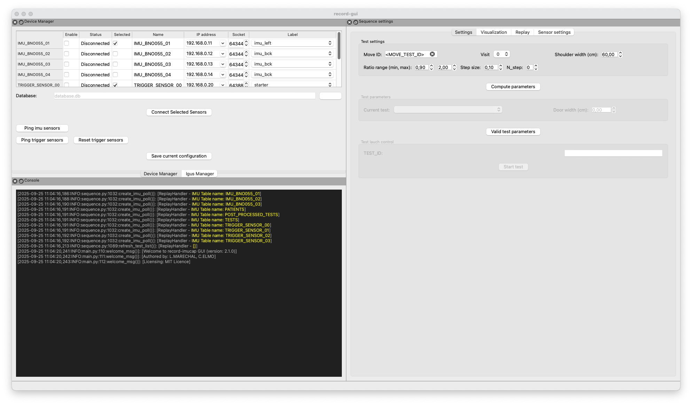
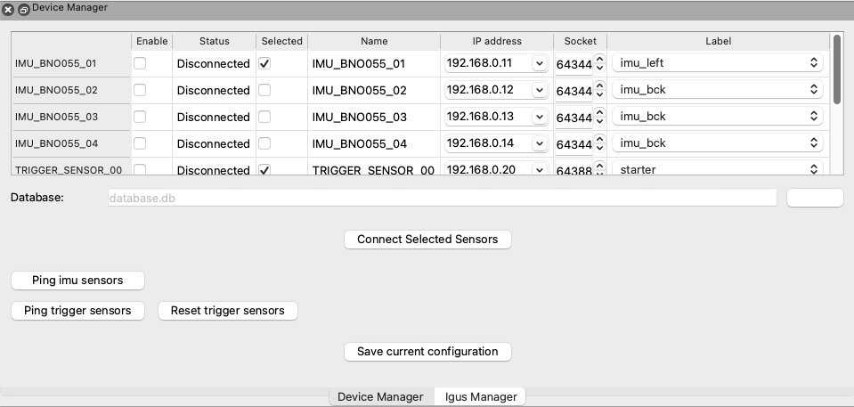

# Record soft user guidelines

## Requirements

### Hardware
 - A set of IMU pods (at least 1)
 - A set of trigger sensors (at least 3)
 - A configured Wi-Fi router to which the IMU pods are connected
 - A computer (laptop or desktop) connected to the same Wi-Fi network as the IMU pods

### On your computer
- A basic understanding of the command line interface (CLI)
- A working installation of the [**Pixi**](https://pixi.sh/latest/) package manager


## Setup

### Fill the device config file
Before the first use, you need to populate the device config file with the details of your IMU pods.
1. Go to the `src/record/configs/config.yml` file. 
2. Fill in the `imus` and `triggers` sections with the information for your devices. The details should match what you provided when setting up their Arduino code.
Here is an example of a config file with two IMU pods and two triggers:

```yaml
imus:
- IMU_BNO055_01:
    ip_address: 192.168.0.11
    label: imu_left
    mac_address: 00:00:00:00:00:00
    selected: true
    socket: 64344
- IMU_BNO055_02:
    ip_address: 192.168.0.12
    label: imu_bck
    mac_address: 00:00:00:00:00:00
    selected: false
    socket: 64344
triggers:
- TRIGGER_SENSOR_00:
    ip_address: 192.168.0.20
    label: starter
    mac_address: 00:00:00:00:00:00
    selected: true
    socket: 64388
- TRIGGER_SENSOR_01:
    ip_address: 192.168.0.21
    label: closer
    mac_address: 00:00:00:00:00:00
    selected: true
    socket: 64388
```
In this example, the IMU pods are named `IMU_BNO055_01` and `IMU_BNO055_02`, and the triggers are `TRIGGER_SENSOR_00` and `TRIGGER_SENSOR_01`. 
The `ip_address` field is the device IP address on the Wi-Fi network, and `socket` is the port number used to send data (it should match the value in the Arduino code).
The `label` field is a custom name that you can use to identify the device in the soft GUI.
The `selected` field is a boolean that indicates whether the IMU pod is preselected so you can use the one-button connect feature described [here](#onebuttonconnect) to connect to multiple devices.

### Running soft
Use your terminal to go to the root directory of this repository and run the following command to install soft:

```bash
pixi install
```

This will install all dependencies and set up the environment.
After installation, you can run the following command to launch soft:

```bash
pixi run soft
```
You will see terminal output similar to the following, and the soft GUI will launch:

```bash
❯ pixi run soft
✨ Pixi task (soft): python ./src/record/gui/main.py
```



### Configure device connection

Settings related to IMU pod connections can be found in the top left of the soft GUI in the dock widget called `Device Manager`.


In the `Device Manager` widget, you can see a list of devices defined in the config file. You can select which IMU pods and triggers you want to use by checking the `selected` box next to each device.
<a name="onebuttonconnect"></a>Then, you can click on the `Connect Selected Sensors` button to connect to the selected devices.

You can also connect to a single device by using the checkbox in the `Enable` column next to the device name. The corresponding `Status` entry should change to `Connected`.

You can check the connection status of each device in the `Status` column. If the device is connected, the status will be `Connected`; otherwise it will be `Disconnected`.
You can also check data reception from each device by clicking the `Ping imu sensors` or `Ping trigger sensors` buttons. You will see data received from each device in the `Console` dock widget at the bottom of the GUI.
